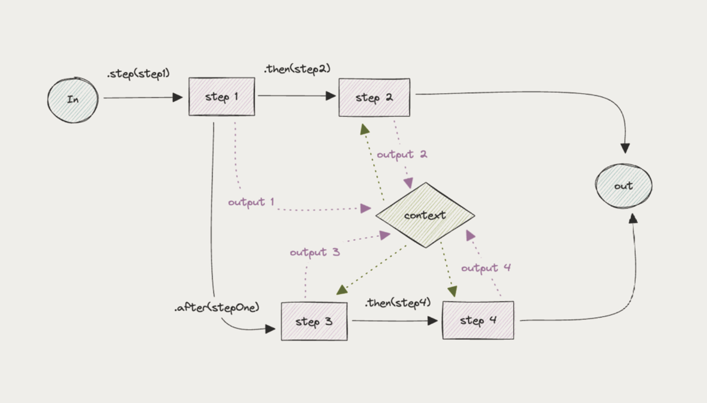
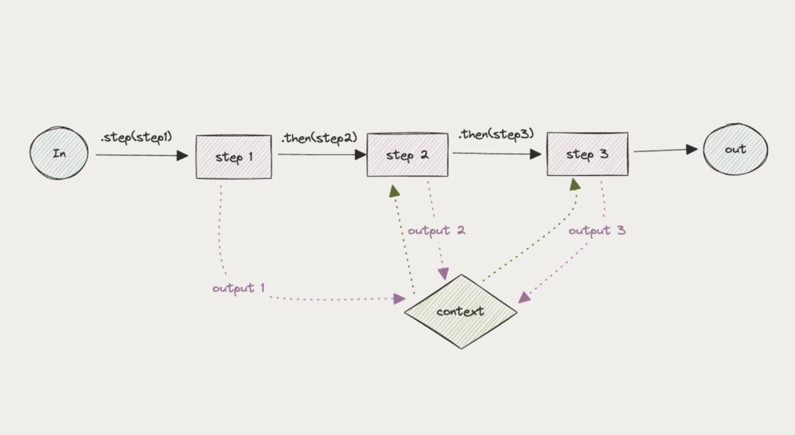
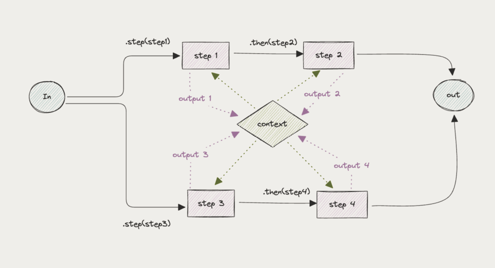

# 13  
## ВЕТВЛЕНИЕ, СОЕДИНЕНИЕ, СЛИЯНИЕ, УСЛОВИЯ

Итак, какой лучший способ построения графов рабочих процессов?  
Давайте рассмотрим основные операции, а затем перейдем к лучшим практикам.

### **Ветвление (Branching)**

Один случай использования ветвления — запуск нескольких вызовов LLM на одном и том же входе.  
Предположим, у вас есть длинная медицинская карта, и нужно проверить наличие 12 различных симптомов (сонливость, тошнота и т.д.).  
Вы могли бы сделать один вызов LLM, проверяющий 12 симптомов. Но это много.  
Лучше иметь 12 параллельных вызовов LLM, каждый проверяющий один симптом.

В Mastra вы создаете ветви с помощью команды `.step()`. Вот простой пример:



### **Соединение (Chaining)**

Это самая простая операция. Иногда вы захотите получить данные из удаленного источника, прежде чем передать их в LLM, или передать результаты одного вызова LLM в другой.

В Mastra вы соединяете шаги с помощью команды `.then()`. Вот простой пример:

Каждый шаг в цепочке ждет завершения предыдущего шага и имеет доступ к результатам предыдущих шагов через контекст.



### **Слияние (Merging)**

После того как ветви расходятся для обработки различных аспектов задачи, им часто нужно снова сойтись, чтобы объединить свои результаты:



### **Условия (Conditions)**

Иногда вашему рабочему процессу необходимо принимать решения на основе промежуточных результатов.

В графиках рабочего процесса, поскольку несколько путей обычно могут выполняться параллельно, в Mastra мы определяем выполнение условного пути на дочернем шаге, а не на родительском.

В этом примере шаг `processData` выполняется при условии успешного выполнения шага `fetchData`.

```javascript
myWorkflow.step(
    new Step({
        id: "processData",
        execute: async ({ context }) => {
            // Action logic
        },
    },
    {
        when: {
            "fetchData.status": "success",
        },
    },
);
```

### **Лучшие практики и примечания**

Полезно составлять шаги таким образом, чтобы ввод/вывод на каждом шаге был в какой-то мере осмысленным, поскольку вы сможете увидеть это в своей трассировке. (Подробнее об этом в разделе Трассировка (Tracing)).

Другой способ — разложить шаги таким образом, чтобы LLM мог выполнять только одну задачу за один раз. Обычно это означает, что на каждом шаге выполняется не более одного вызова LLM.

Комбинируя эти примитивы, можно создать множество различных частных случаев графиков рабочего процесса, таких как циклы, повторные попытки и т.д.