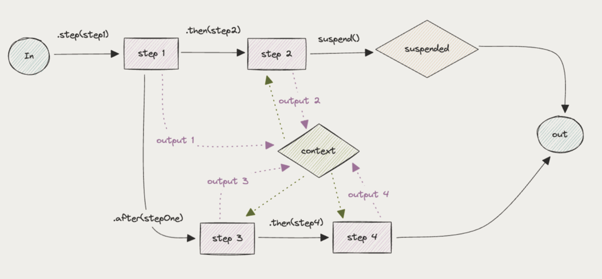
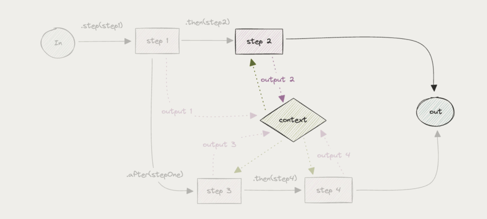

# 14
## ПАУЗА И ВОЗОБНОВЛЕНИЕ

Иногда рабочим процессам необходимо приостановить выполнение в ожидании ввода от третьей стороны (например, человека в цикле).

Поскольку третья сторона может отвечать сколь угодно долго, вы не хотите держать запущенный процесс.

Вместо этого вы хотите сохранить состояние рабочего процесса и иметь некоторую функцию, которую можно вызвать, чтобы продолжить с того места, где вы остановились.

Давайте визуализируем простой пример с Mastra, в котором есть функции `.suspend()` и `.resume()`:



Для обработки приостановленных рабочих процессов вы можете отслеживать изменения статуса и возобновлять выполнение, когда работа выполнена:



Вот простой пример создания рабочего процесса с приостановкой и возобновлением в Mastra.

Шаги — это строительные блоки рабочих процессов.
Создайте шаг с помощью `createStep`:

```javascript
// Create a step with defined input/output schemas and execution logic
const inputSchema = z.object({
    inputValue: z.string(),
});

const myStep = createStep({
    id: "my-step",
    description: "Does something useful",
    inputSchema,
    outputSchema: z.object({
        outputValue: z.string(),
    }),
    // Optional: Define the resume schema for step resumption
    resumeSchema: z.object({
        resumeValue: z.string(),
    }),
    // Optional: Define the suspend schema for step suspension
    suspendSchema: z.object({
        suspendValue: z.string(),
    }),
    execute: async ({
        inputData,
        mastra,
        getStepResult,
        getInitData,
        runtimeContext,
    }) => {
        const otherStepOutput = getStepResult(step2);
        const initData = getInitData<typeof inputSchema>(); // typed as the input schema variable (zod schema)
        return {
            outputValue: `Processed: ${inputData.inputValue}, ${initData.startValue}, {runtimeContextValue: ${runtimeContext.get("runtimeContextValue")}`,
        };
    },
});
```

Затем создайте рабочий процесс с помощью `createWorkflow`:

```javascript
// Create a workflow with defined steps and execution flow
const myWorkflow = createWorkflow({
    id: "my-workflow",
    // Define the expected input structure (should match the first step's inputSchema)
    inputSchema: z.object({
        startValue: z.string(),
    }),
    // Define the expected output structure (should match the last step's outputSchema)
    outputSchema: z.object({
        result: z.string(),
    }),
    steps: [step1, step2, step3], // Declare steps used in this workflow
})
.then(step1)
.then(step2)
.then(step3)
.commit();
    
// Register workflow with Mastra instance
const mastra = new Mastra({
    vnext_workflows: {
        myWorkflow,
    },
});

// Create a run instance of the workflow
const run = mastra.vnext_getWorkflow("myWorkflow").createRun();
```

После определения рабочего процесса запустите его так:

```javascript
// Create a run instance
const run = myWorkflow.createRun();

// Start the workflow with input data
const result = await run.start({
    inputData: {
        startValue: "initial data",
    },
});

// Access the results
console.log(result.steps); // All step results
console.log(result.steps["step-id"].output); // Output from a specific step

if (result.status === "success") {
    console.log(result.result); // The final result of the workflow, result of the last step (or '.map()' output, if used as last step)
} else if (result.status === "suspended") {
    const resumeResult = await run.resume({
        step: result.suspended[0], // there is always at least one step id in the suspended array, in this case we resume the first suspended execution path
        resumeData: {
            /* user input */
        },
    });
} else if (result.status === "failed") {
    console.error(result.error); // only exists if status is failed, this is an instance of Error
}
```