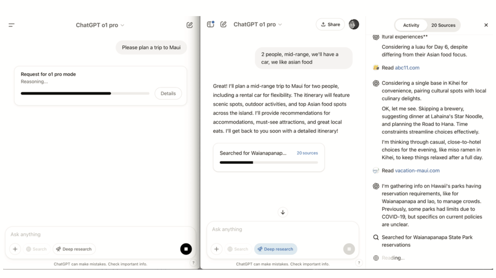

# 15
## СТРИМИНГ ОБНОВЛЕНИЙ

Один из ключей к тому, чтобы LLM-приложения казались быстрыми и отзывчивыми, — это показывать пользователям, что происходит, пока модель работает. Мы внедрили некоторые большие улучшения здесь, и наша новая демонстрация действительно показывает, на что способен современный стриминг.

Давайте вернемся к моим продолжающимся (и все еще безуспешным) поискам по планированию поездки на Гавайи.

В прошлом году я попробовал одновременно две модели с рассуждениями: OpenAI o1 pro (левая вкладка) и Deep Research (правая вкладка).

o1 pro просто показывал вращающийся компонента «reasoning» в течение трех минут — никакой обратной связи, просто ожидание.
Deep Research, с другой стороны, мгновенно спросил меня о деталях (количество людей, бюджет, диетические потребности), а затем стримил обратно обновления по мере того, как он находил рестораны и достопримечательности. Он казался намного быстрее и держал меня в курсе все время.

### **Как стримить изнутри функций**

Вот загвоздка: когда вы создаете LLM-агентов, вы обычно стримите внутри функции, которая ожидает определенный тип возвращаемого значения. Иногда вам приходится ждать всего вывода LLM, прежде чем функция сможет вернуть результат пользователю. Но что, если функция выполняется вечность? Вот тут-то все и становится сложнее. В идеале вы хотите стримить пошаговый прогресс пользователю, как только он у вас есть, а не вываливать все в конце.

Многие люди обходят это. Например, Саймон в Assistant UI настроил свое приложение так, чтобы оно записывало каждый токен от OpenAI прямо в базу данных по мере его поступления в потоке, используя ElectricSQL для мгновенной синхронизации этих обновлений с фронтендом. Это создает своего рода «План Б» — даже если функция не завершена, пользователь видит живой прогресс.

### **Почему стриминг важен**

Самая частая вещь для стриминга — это собственный вывод LLM (показ токенов по мере их генерации). Но вы также можете стримить обновления от каждого шага в многошаговом рабочем процессе или конвейере агента, например, когда агент выполняет поиск, планирование и суммирование последовательно.

Это держит пользователей вовлеченными и уверенными, что дело движется, даже если бэкенд все еще обрабатывает.

### **Как это построить**

*   **Стримите как можно больше:** Будь то токены, шаги рабочего процесса или пользовательские данные, доставляйте их пользователю ASAP (As Soon As Possible).
*   **Используйте реактивные инструменты:** Библиотеки, такие как ElectricSQL, или фреймворки, такие как Turbo Streams, облегчают синхронизацию обновлений бэкенда прямо с UI.
*   **Escape hatches:** Если ваша функция застряла в ожидании, найдите способы протолкнуть частичные результаты или обновления прогресса на фронтенд.

**Суть:** Стриминг — это не просто приятное дополнение — он критически важен для хорошего UX в LLM-приложениях. Пользователи хотят видеть прогресс, а не просто пустой экран. Если вы справитесь с этим, ваши агенты будут казаться быстрее и надежнее, даже если бэкенд все еще усердно работает.

Теперь, если бы только стриминг могло помочь мне действительно добраться до Гавайев…