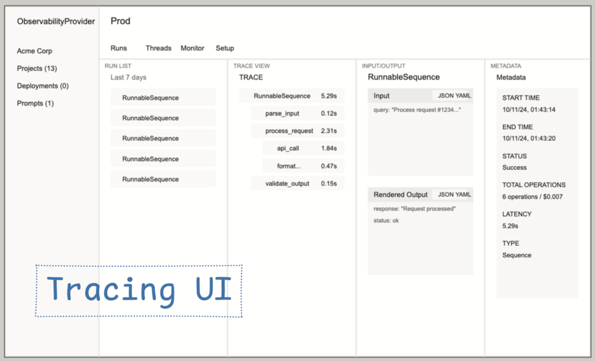
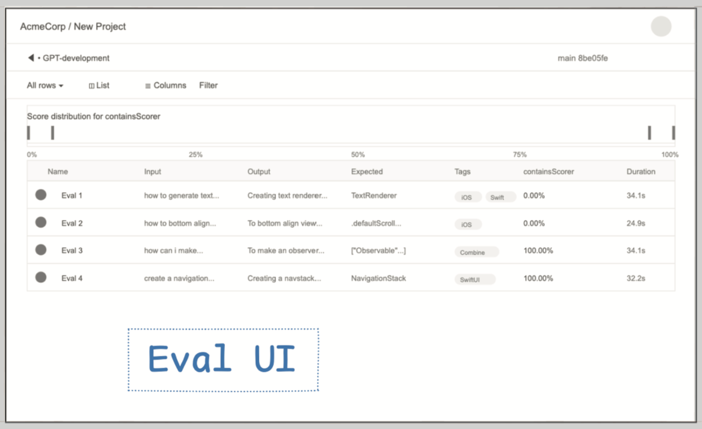

# 16
## НАБЛЮДАЕМОСТЬ И ТРАССИРОВКА

Поскольку LLM недетерминированы (результат нельзя предсказать заранее на 100%), вопрос не в том, сойдет ли ваше приложение с рельсов.
А в том, когда и насколько.

Команды, которые запустили агентов в продакшен, обычно говорят о том, как важно смотреть на продакшен-данные для каждого шага, каждого запуска каждого из их рабочих процессов.

Фреймворки агентов, такие как Mastra, которые позволяют писать ваш код как структурированные графы рабочих процессов, также будут выполнять телеметрию, которая отобразит это.

### **Наблюдаемость (Observability)**

Наблюдаемость — это слово, которое часто упоминается, но поскольку его значение было сильно размыто и обобщено заинтересованными поставщиками, давайте обратимся к истокам.

Первоначальный термин был популяризирован благотворительными организациями Honey-comb в конце 2010-х годов для описания качества визуализации следов применения.

### **Трассировка (Tracing)**

Чтобы отладить функцию, было бы хорошо иметь возможность видеть вход и выход каждой функции, которую она вызывает. И вход и выход каждой функции, которую вызывают эти функции. (И так далее, и так далее, черепахи до самого низа).

Этот вид телеметрии называется трассировкой, которая состоит из дерева отрезков. (Представьте себе вложенный HTML-документ или диаграмму flame).

Стандартный формат для трассировки известен как OpenTelemetry, или сокращенно OTel. Когда поставщики мониторинга начали поддерживать трассировку, у каждого была своя спецификация — не было переносимости. Бен Сигельман из Lightstep помог создать общий стандарт Otel, и более крупные поставщики, такие как Datadog (under duress), начали поддерживать Otel.

Существует большое количество поставщиков наблюдаемости, как более старых бэкенд-ориентированных, так и специфичных для ИИ, но UI паттерны сходятся:

### **Пример экрана трассировки**

Что дает вам такой UI экран:

*   **Представление трассировки.** Это показывает, сколько времени занял каждый шаг в конвейере (например, `parse_input`, `process_request`, `api_call` и т.д.)
*   **Инспекция ввода/вывода.** Видеть точный «Input» и «Output» в JSON helpful для отладки данных, flowing в и из LLM.
*   **Метаданные вызова.** Показ статуса, времени начала/окончания, задержки и т.д.) предоставляет ключевой контекст вокруг каждого запуска, помогая людям, отслеживать аномалии.

### **Оценки (Evals)**

Также хорошо иметь возможность видеть ваши оценки (подробнее об оценках позже) в облачной среде.

Для каждой из своих оценок люди хотят видеть сравнение 1 к 1 того, как агент отвечает, с тем, что ожидалось.

Они хотят видеть общий балл по каждому PR (чтобы убедиться в отсутствии регрессий), и балл с течением времени, а также фильтровать по тегам, дате запуска и т.д.

UI оценок как правило, выглядит следующим образом:

### **Пример экрана оценки**

### **Финальные заметки по наблюдаемости и трассировке**

*   Вам понадобится облачный инструмент для просмотра такого рода данных для вашего продакшен-приложения.
*   Также хорошо иметь возможность смотреть на эти данные локально, когда вы разрабатываете (Mastra делает это). Подробнее об этом в разделе локальной разработки.
*   Существует общий стандарт, который называется OpenTelemetry, или сокращенно OTel, и мы настоятельно рекомендуем использовать этот формат.