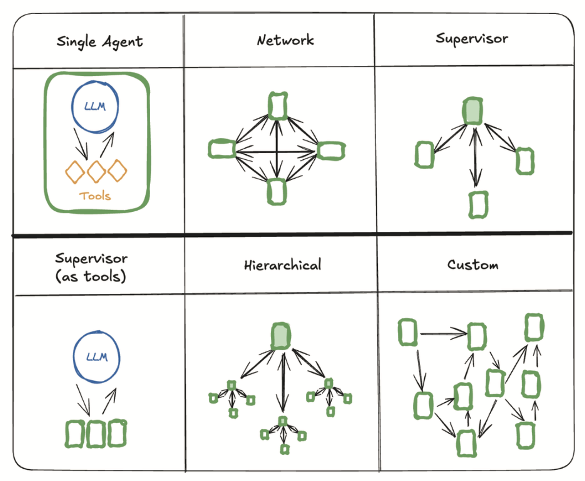

# 21
## ОСНОВЫ МУЛЬТИАГЕНТНЫХ СИСТЕМ

Думайте о мультиагентных системах как о специализированной команде, например, по маркетингу или разработке, в компании. Различные ИИ-агенты работают вместе, каждый со своей специализированной ролью, чтобы в конечном итоге выполнять более сложные задачи.

Интересно, что если вы использовали инструмент генерации кода, такой как агент Replit, который развернут в продакшене, вы уже фактически использовали мультиагентную систему.

Один агент работает с вами, чтобы планировать / архитектурить ваш код. После того как вы поработали с агентом над планом, вы работаете с агентом-«менеджером кода», который передает инструкции писателю кода, затем выполняет полученный код в песочнице и передает любые ошибки обратно писателю кода.

Каждый из этих агентов имеет разную память, разные системные промпты и доступ к разным инструментам.

Мы часто шутим, что проектирование мультиагентной системы включает в себя множество навыков, используемых в организационном дизайне. Вы пытаетесь сгруппировать связанные задачи в описание должности, на которую вы могли бы правдоподобно нанять кого-то. Вы можете дать творческие или генеративные задачи одному человеку, а задачи по проверке или анализу — другому.

Вы хотите подумать о сетевой динамике. Лучше ли трем специализированным агентам сплетничать между собой, пока не будет достигнут консенсус? Или передавать их вывод агенту-менеджеру, который может принять решение?

Одним из преимуществ мультиагентных систем является разбиение сложных задач на управляемые части. И, конечно, одни и те же принципы дизайна повторяются на всех уровнях. Иерархия — это просто руководитель руководителей. Но начните с самой простой версии сначала.

Давайте разберем некоторые паттерны.