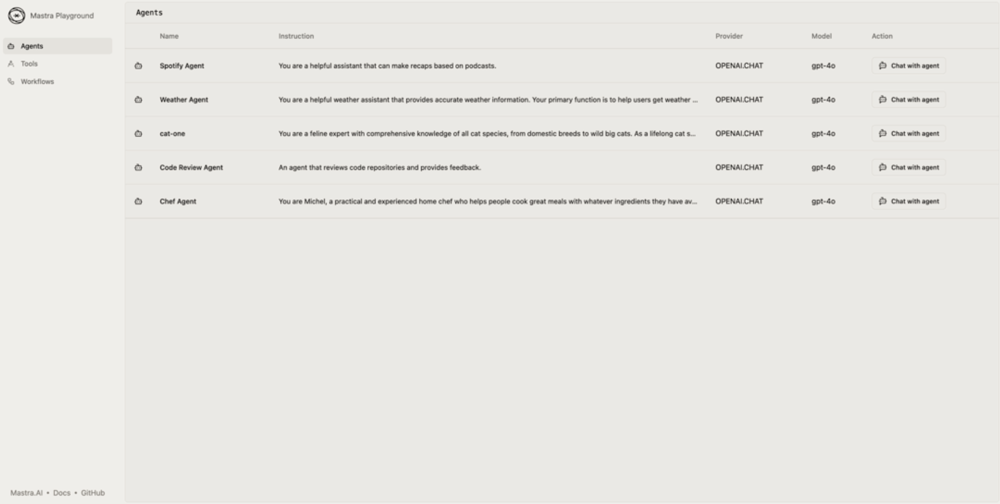

# 30
## ЛОКАЛЬНАЯ РАЗРАБОТКА

Разработка агентов обычно делится на две разные категории: создание фронтенда и бэкенда.

### **Создание агентного веб-фронтенда**

Веб-фронтенды агентов имеют несколько общих характеристик: они построены вокруг чат-интерфейса, стримятся на бэкенд, автоматически прокручиваются, отображают вызовы инструментов.

Мы обсуждали важность стриминга в предыдущей главе. Агентные интерфейсы имеют тенденцию использовать различные варианты транспорта, такие как запрос/ответ, server-sent events, вебхуки и веб-сокеты, все для создания ощущения интерактивности в реальном времени.

Есть несколько фреймворков, которые, как мы видим, ускоряют разработку здесь, особенно на этапе прототипирования: Assistant UI, Copilot Kit и Vercel's AI SDK UI.

(И многие агенты основаны на других платформах, таких как WhatsApp, Slack или электронная почта, и не имеют веб-фронтенда!)

Важно отметить, что хотя агентные фронтенды могут быть мощными, полная логика агента обычно не может находиться на стороне клиента в браузере по соображениям безопасности — это привело бы к утечке ваших API-ключей к провайдерам LLM.

### **Создание бэкенда агента**

Так что именно в бэкенде мы обычно видим большую часть сложности.

При разработке ИИ-приложений важно видеть, что делают ваши агенты, убедиться, что ваши инструменты работают, и иметь возможность быстро итеративно улучшать ваши промпты.

Некоторые вещи, которые, как мы видели, полезны для локальной разработки агентов:

*   **Чат-интерфейс агента:** Тестируйте разговоры с вашими агентами в браузере, видя, как они реагируют на разные вводы и используют свои настроенные инструменты.
*   **Визуализатор рабочих процессов:** Просмотр пошагового выполнения рабочего процесса и возможность приостанавливать/возобновлять/переигрывать.
*   **Эндпоинты агентов/рабочих процессов:** Возможность выполнять curl запросы к агентам и рабочим процессам на localhost (это также позволяет использовать, например, Postman).
*   **Песочница инструментов:** Тестирование любых инструментов и возможность проверять вводы/выводы без необходимости вызывать их через агента.
*   **Трассировка и оценки:** Просмотр входов и выходов каждого шага выполнения агента и рабочего процесса, а также метрик оценок по мере итерации над кодом.

Вот скриншот из локальной среды разработки Mastra:
