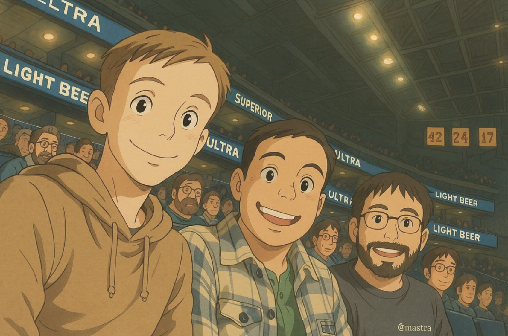

# 32
## МУЛЬТИМОДАЛЬНОСТЬ

Один из способов думать о мультимодальности (изображения, видео, голос) в ИИ — это нанести на карту даты их появления на различных платформах.

Рассмотрим Интернет: он поддерживал текст с момента своего возникновения в 1970-х годах, но изображения и видео не поддерживались до веб-браузера (1992), а голос — до 1995 года.

Голос и видео не стали популярными до YouTube (2002) и Skype (2003), с большей пропускной способностью и скоростью соединения.

Или подумайте о социальных сетях: все ранние, такие как MySpace (2002), Facebook (2004) и Twitter (2008), были в основном текстовыми.

Социальные медиа на основе изображений не стали популярными до Instagram (2010) и Snapchat (2013), а на основе видео — до TikTok (2017).

В ИИ, тогда, неудивительно, что мультимодальные случаи использования в некотором роде моложе и менее зрелые. Как и на более ранних платформах, их сложнее правильно реализовать, и они более сложны в вычислительном отношении.

### **Генерация изображений**

Март 2025 года принес изобретение Ghibli-core — подумайте о мягких цветах, сказочных фонах и тех культовых большеглазых персонажей.

Люди уже некоторое время играли с Midjourney, Stable Diffusion и другими. Но март стал шагом вперед в потребительской генерации изображений, с возможностью трансформировать фотографии в определенные стили.

Люди загружали селфи или старые фотографии, добавляли промпт и мгновенно получали аниме-версию, которая выглядела так, как будто она прямо из «Унесенных призраками».

Сооснователи Mastra (Шейн, Абхи и Сэм) на баскетбольном матче



Это не было просто нишевой вещью; тренд Ghibli захватил ленты социальных сетей повсюду. Официальный аккаунт (Трампа) Белого дома присоединился к fray, (спорно) tweeted картинку задержанного иммигранта в стиле Ghibli.

В более широком смысле, момент «Ghibli» показал жизнеспособность варианта использования цифрового искусства — генерация изображений для чего-то среднего между раскадровкой, наброском персонажа и концепциями окружения.

### **Варианты использования**

С точки зрения использования генерации изображений в продуктах, есть несколько вариантов использования.

В маркетинге и электронной коммерции, макеты продуктов на различных фонах и быстрая генерация рекламного креатива без фотосессий и в различных форм-факторах. Модели изображений «примерки» позволяют людям заменять человеческую модель, но сохранять демонстрируемый предмет одежды.

Третий вариант использования генерации изображений был в производстве видеоигр и фильмов. Генерация изображений позволила прототипировать ассеты, включая портреты, текстуры, реквизит, а также планировать компоновку сцен с помощью грубых потоков «от эскиза к рендеру».

Выражаясь в терминах веб-разработки, это дает детализацию полного дизайна с усилиями/навыками каркаса.

Наконец, есть более NSFW варианты использования. Они имеют тенденцию не привлекать венчурное финансирование, но, по крайней мере, согласно слухам Silicon Valley, довольно многие из более рискованных вариантов использования печатают деньги — если вы можете найти платежный процессор, который примет ваш бизнес.

### **Голос**

Ключевые модальности в голосе — это речь-в-текст (STT), текст-в-речь (TTS) и речь-в-речь, также известная как голос в реальном времени.

Что пользователи хотят в голосовом продукте-агенте, так это что-то, что может понять их тон и ответить немедленно.

Чтобы сделать это, вы могли бы обучить модель, которая принимает голосовые токены как вход и отвечает голосовыми токенами как выход. Это известно как «голос в реальном времени», но это оказалось challenging.

Во-первых, сложно обучать такие модели; информационная плотность аудио составляет только 1/1000 от текста, поэтому этим моделям требуется существенно больше входных данных для обучения, и они дороже в обслуживании.

Во-вторых, у этих моделей все еще есть проблемы с переключением внимания, известным в отрасли как “распознавание голосовой активности”. При разговоре люди постоянно перебивают друг друга, используя как визуальные, так и эмоциональные сигналы.

Но голосовые модели не обладают такими возможностями, и им приходится иметь дело как с вычислительной, так и с сетевой задержкой. Когда они прерывают слишком рано, они прерывают людей; когда они прерывают слишком поздно, они звучат как роботы.

Хотя эти продукты отлично подходят для демонстраций, не так много компаний используют голос в реальном времени в продакшене.

Вместо этого они используют пайплайн речь-в-текст (STT) и текст-в-речь (TTS). Они используют одну модель для преобразования входного голоса в текст, другую модель для генерации текста ответа, а затем преобразуют текст ответа в аудиоответ.

Вот пример прослушивания; вы могли бы дополнить это вызовом agent.speak() для ответа.

```javascript
import { Agent } from "@mastra/core/agent";
import { OpenAIVoice } from "@mastra/voice-openai";

const agent = new Agent({
    name: 'Agent',
    instructions: 'You are a helpful assistant with voice capabilities.',
    model: openai('gpt-4o'),
    voice: new OpenAIVoice(),
});

const audioStream = fs.createReadStream('./path/to.mp3');
const text = await agent.listen(audioStream);

// Hey! How are ya!
```

### **Видео**

Продукты генерации ИИ-видео, хотя и захватывающий, еще не перешли от машинного обучения к инженерии ИИ.

Потребительские модели еще не имели своего момента Studio Ghibli, когда они могут точно представлять персонажей на входе и воспроизводить их в альтернативных условиях.

В результате для создания продуктов, как правило, требуется много специальных знаний, и они потребляют много графических циклов во время выполнения, генерируя аватары на основе пользовательских данных, которые затем могут быть воспроизведены в новых настройках и сценариях.