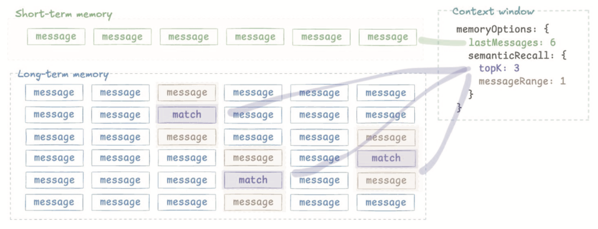

# 7  
## ПАМЯТЬ АГЕНТА

Память критически важна для создания агентов, которые поддерживают осмысленные, контекстные беседы с течением времени. Хотя LLM могут эффективно обрабатывать отдельные сообщения, им нужна помощь в управлении долгосрочным контекстом и историей взаимодействий.

### **Рабочая память**

Рабочая память хранит релевантные, постоянные, долгосрочные характеристики пользователей. Популярный пример того, как увидеть рабочую память, — спросить у ChatGPT, что он знает о вас.

(В моем случае, потому что мои дети часто разговаривают с ним на моих устройствах, он скажет мне, что я пятилетняя девочка, которая любит Squishmallows.)

### **Иерархическая память**

Иерархическая память — это сложный способ сказать: используйте последние сообщения вместе с релевантными долговременными воспоминаниями.

Например, предположим, что у нас был разговор. Через несколько минут вы спросили меня, что я делал в прошлые выходные.

Когда вы спрашиваете, я ищу в своей памяти релевантные события (т.е. с прошлых выходных). Затем я думаю о последних нескольких сообщениях, которыми мы обменялись. Затем я объединяю эти две вещи в своем «контекстном окне» и формулирую ответ вам.

Грубо говоря, так же выглядит и хорошая система памяти агента. Возьмем простой случай: у нас есть массив сообщений, пользователь отправляет запрос, и мы хотим решить, что включить.

Вот как мы бы сделали это в Mastra:

```javascript
// Example: User asks about a past feature discussion
await agent.stream('What did we decide about the search feature last week?',
{ 
    memoryOptions: {
        lastMessages: 10,
        semanticRecall: {
            topK: 3,
            messageRange: 2,
        },
    },
});
```

- Настройка `lastMessages` поддерживает скользящее окно самых последних сообщений. Это гарантирует, что ваш агент всегда имеет доступ к непосредственному контексту разговора.  
- `semanticRecall` указывает, что мы будем использовать RAG (об этом позже) для поиска по прошлым разговорам.  
- `topK` — это количество сообщений для извлечения.  
- `messageRange` — это диапазон с каждой стороны совпадения для включения.

  
**Визуализация процесса извлечения памяти**

Вместо того чтобы перегружать модель всей историей разговора, она избирательно включает самые релевантные прошлые взаимодействия.

Будучи избирательными в отношении того, какой контекст включать, мы предотвращаем переполнение контекстного окна, сохраняя при этом самую релевантную информацию для текущего взаимодействия.

> **Примечание:** По мере того как контекстные окна продолжают расти, разработчики часто начинают с того, что помещают все в контекстное окно и настраивают память позже!

### **Процессоры памяти**

ИНОГДА УВЕЛИЧЕНИЕ вашего контекстного окна не является правильным решением. Это контр-интуитивно, но иногда вы хотите намеренно обрезать свое контекстное окно или просто контролировать его.

Процессоры памяти позволяют вам изменять список сообщений, извлеченных из памяти, прежде чем они будут добавлены в контекстное окно агента и отправлены в LLM. Это полезно для управления размером контекста, фильтрации контента и оптимизации производительности.

Mastra предоставляет встроенные процессоры.

#### **`TokenLimiter`**

Этот процессор используется для предотвращения ошибок, вызванных превышением лимита контекстного окна LLM. Он подсчитывает токены в извлеченных сообщениях памяти и удаляет самые старые сообщения, пока общее количество не окажется ниже указанного лимита.

```javascript
import { Memory } from "@mastra/memory";
import { TokenLimiter } from "@mastra/memory/processors";
import { Agent } from "@mastra/core/agent";
import { openai } from "@ai-sdk/openai";

const agent = new Agent({
    model: openai("gpt-4o"),
    memory: new Memory({
        processors: [
            // Ensure the total tokens from memory don't exceed ~127k
            new TokenLimiter(127000),
        ],
    }),
});
```

#### **`ToolCallFilter`**

Этот процессор удаляет вызовы инструментов из сообщений памяти, отправляемых в LLM. Он экономит токены, исключая потенциально многословные взаимодействия с инструментами из контекста, что полезно, если детали не нужны для будущих взаимодействий. Это также полезно, если вы всегда хотите, чтобы ваш агент снова вызывал определенный инструмент и не полагался на предыдущие результаты инструментов в памяти.

```javascript
import { Memory } from "@mastra/memory";
import { ToolCallFilter, TokenLimiter } from "@mastra/memory/processors";

const memoryFilteringTools = new Memory({
    processors: [
        // Example 1: Remove all tool calls/results
        new ToolCallFilter(),
        // Example 2: Remove only noisy image generation tool calls/results
        new ToolCallFilter({ exclude: ["generateImageTool"] }),
        // Always place TokenLimiter last
        new TokenLimiter(127000),
    ],
});
```